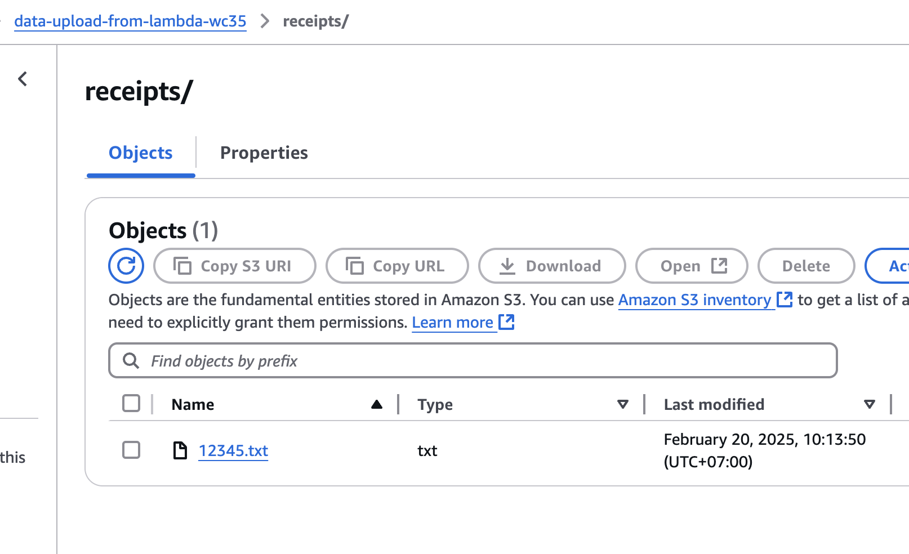

# Quick Start for Lambda
A quick start for Lambda serverless function interacting with S3 bucket using Terraform configuration for provisioning and configuration management. The modules in Terraform configuration performs S3 buckets creation for the Lambda function itself and for data upload with basic security and ACL. It creates a Lambda function to receive details of order and performs upload operation. It also create API gateway for clients from internet to consume.

## Pre-requisites


* Terraform binary - If you currently don't have Terraform installed on your machine, this [guide](https://developer.hashicorp.com/terraform/install) will show you how to install the executable.
* AWS account - AWS credential is required for AWS provider. Without modification to any part of the configuration, you may choose to use AWS profile or Environment Variable method, listed in this [guide](https://registry.terraform.io/providers/hashicorp/aws/latest/docs#authentication-and-configuration), otherwise the provider configuratoin can be modified to suit the need with any supported method.
* 
## S3

### Create S3 bucket for Lambda function with restricted access

```
resource "random_string" "bucket_suffix" {
  length  = 4
  special = false
  upper   = false
}

resource "aws_s3_bucket" "lambda_bucket" {
  bucket = "lambda-file-upload-with-terraform-${random_string.bucket_suffix.result}"

  
  lifecycle {
    prevent_destroy = false
  }
}

resource "aws_s3_bucket_ownership_controls" "lambda_bucket" {
  bucket = aws_s3_bucket.lambda_bucket.id
  rule {
    object_ownership = "BucketOwnerPreferred"
  }
}

resource "aws_s3_bucket_acl" "lambda_bucket" {
  depends_on = [aws_s3_bucket_ownership_controls.lambda_bucket]

  bucket = aws_s3_bucket.lambda_bucket.id
  acl    = "private"
}
```


### Similarly, create S3 bucket for data upload with restricted access

```

resource "aws_s3_bucket" "data_bucket" {
  bucket = "data-upload-from-lambda-${random_string.bucket_suffix.result}"

  lifecycle {
    prevent_destroy = false
  }
}

resource "aws_s3_bucket_ownership_controls" "data_bucket" {
  bucket = aws_s3_bucket.data_bucket.id
  rule {
    object_ownership = "BucketOwnerPreferred"
  }
}

resource "aws_s3_bucket_acl" "data_bucket" {
  depends_on = [aws_s3_bucket_ownership_controls.data_bucket]

  bucket = aws_s3_bucket.data_bucket.id
  acl    = "private"
}

```

## Lambda

The [Python script](./lambda/functions/upload.py) reads data from json posted into the function and extract order id to be used as filename/key stored on the S3 bucket. The `aws_lambda_function` resource is used to manage the Lambda function with associated role `aws_iam_role.lambda_exec.arn` to assume with appropriate policies attached. 

```
resource "aws_lambda_function" "upload_function" {
  function_name = "FileUploadFunction"

  s3_bucket = var.s3_bucket_id
  s3_key    = aws_s3_object.upload_function.key

  runtime = "python3.9"
  handler = "upload.lambda_handler"

    environment {
      variables = {
        RECEIPT_BUCKET = var.s3_data_bucket_id
      }
    }
  source_code_hash = data.archive_file.upload_function.output_base64sha256
  
  role = aws_iam_role.lambda_exec.arn
}
```

## API Gateway

The resource `aws_apigatewayv2_route` of API Gateway defines the proxy service for the Lambda function via `POST` method at the path `/upload` receiving json data to pass as input parameter to the Lambda function. The cloud watch log group is defined using the resource `aws_cloudwatch_log_group` and can be used for troubleshooting.

```
resource "aws_apigatewayv2_route" "fileupload" {
  api_id = aws_apigatewayv2_api.fileupload.id

  route_key = "POST /upload"
  target    = "integrations/${aws_apigatewayv2_integration.fileupload.id}"
}

resource "aws_cloudwatch_log_group" "api_gw" {
  name = "/aws/api_gw/${aws_apigatewayv2_api.fileupload.name}"

  retention_in_days = 7
}
```

## Test

- Create a sample data file by running the command below at terminal prompt.
  
    ```
    cat >data.json<<-EOF
    {
        "Order_id": "12345",
        "Amount": 199.99,
        "Item": "Wireless Headphones"
    }
    EOF
    ```

- Using `curl` command to ***POST*** data to the endpoint.

    ```
    curl -X POST -H "Content-Type: application/json" --data @data.json "$(terraform output -raw base_url)/upload"
    ```

    